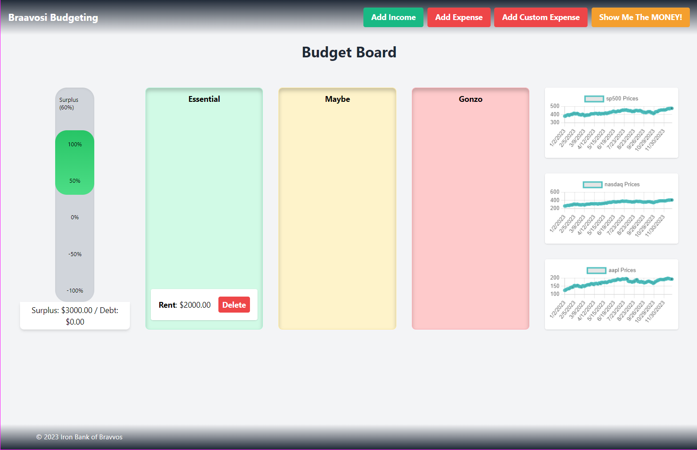

# Game Of Loans - Braavosi Budgeting Application

## Description

• Welcome to the Braavosi Budgeting Application, the dynamic budgeting application designed to help you manage your finances with ease and insight. Tailored for both financial novices and savvy savers, BudgetMaster offers an intuitive and responsive interface to make budgeting a straightforward and engaging process.

## Link to Deployed Application.

• [https://jtoton.github.io/GameOfLoans/]

## Table of Contents:

- [Installation](#installation)
- [Usage](#usage)
- [Credits](#credits)
- [License](#license)
- [Mockup](#Mockup)
- [Badges](#Badges)
- [Features](#Features)
- [Contributions](#Contributions)
- [Tests](#Tests)
- [Citations](#Citations)

## Installation

• There are no installation steps required. The project is housed within a GitHub repository that has an index.html file within it. All assets and files are included within the folders and sub-folders located on the repo.
If one wanted to pull the repo to examine the project in detail then cloning the repository would be the only step required. Otherwise the link is live and can be accessed here on GitHub.

## Usage

• Create card tasks to track the workflow of ones our projects or team projects.

• Modal that opens upon request in order to enter details for task cards: Title, Description and Due Date.

• Interactive movement and color coding.

• Card management through movable dragging and deletion.

## Credits

• All credit for the materials, files and code are giving to the bootcamp instructors and the information provided within the course material.

• Information and details can be found here: [https://bootcampspot.instructure.com/courses/5301/assignments/74767?module_item_id=1209851].

• Additionally, the base project was cloned from this repository (README and Instructions). [https://git.bootcampcontent.com/University-of-Utah/UofU-VIRT-FSF-PT-02-2024-U-LOLC].

• Other examples or assistance was located from: [https://www.w3schools.com/html/html5_semantic_elements.asp].

• Any and all other information gathered was located via links provided in the previously cited school links which housed other resources and links to view and learn from.

## License

• This project has a standard MIT license. Source: https://choosealicense.com/licenses/mit/

• This license seemed appropriate given that it will be accessed, cloned and assessed by any and all who may be performing a review, assessment or grading of the project and my work herewithin.

## Badges

## Mockup

## Features

• Drag and Drop Expense Cards: Easily categorize your spending by dragging and dropping cards that represent different expenses. Start with our pre-made list of common expenditure categories, 
  or create custom cards to suit your unique financial needs.

• Financial Health Meter: At a glance, see your financial status displayed on our meter that dynamically tracks your surplus and debt levels. This real-time visual helps you quickly understand 
  whether you're living within your means or need to adjust your spending habits.

• Live Financial Market Graphs: Stay informed with live graphs displaying the latest data from major financial indices, including the S&P 500, NASDAQ, and Apple stock prices. These graphs 
  update in real time, providing you with valuable market insights directly within the app.

• YouTube API Integration: Depending on your financial situation, receive personalized video recommendations through our integration with the YouTube API. Whether you're in debt and need 
  advice on managing finances, or in surplus and looking for investment tips, BudgetMaster provides relevant content to help guide your decisions.

• Mobile Responsive Design: Access your budget anytime, anywhere. BudgetMaster is fully responsive, making it easy to manage your finances from any device—perfect for on-the-go budgeting.

## Contributions

• Contribuation are not welcome and or accepted.

• This project is a graded assignment that will reflect our groups progress within the first 1 to 2 weeks of class.

• However, it will be accessed, cloned and assessed by any and all who may be performing a review, assessment or grading of the project and my work herewithin.

• That being said, any of the aforementioned representatives of the school or private company that are responsible for accessing, grading or reviewing the project have expressed permission to edit, add notes, add comments or perform any work necessary to complete this task.

## Tests

• Testing has not been included within this project as of yet. I look forward to learning more about this process, given my QA experience, and adding it to the project in the future.

## Citations

• Agile Alliance. (2023, October 18). Agile Manifesto for Software Development | Agile Alliance. Agile Alliance |. https://www.agilealliance.org/agile101/the-agile-manifesto/

• CSS Property: list-style-type | HTML Dog. (n.d.). https://www.htmldog.com/references/css/properties/list-style-type/

• GitHub: Let’s build from here. (n.d.). GitHub. https://github.com/

• OpenAI. (2023). ChatGPT (Mar 14 version) [Large Language model]. (n.d.). ChatGPT (Mar 14 Version) [Large Language Model]. https://chat.openai.com/chat

-NOTE: ChatGPT was only used to assist in creating dialog for the README file. The OpenAI software was not used to assist in any code generation, HTML edits, CSS edits or
otherwise any of the assets located within the repository other than this README specifically. The software was used to assist in creating a professional README.md file that
would meet standards within the industry (to the best of my knowledge). Additionally, school resources, linked within the citations already, were used in combination to flush
out the design.

• GitLab. (n.d.). https://git.bootcampcontent.com/University-of-Utah/UofU-VIRT-FSF-PT-02-2024-U-LOLC

• Curriculum | University of Utah Professional Education Coding Boot Camp. (2024, March 6). University of Utah Professional Education Boot Camps. https://bootcamps.continue.utah.edu/coding/curriculum/

• JavaScript Array reference. (n.d.). https://www.w3schools.com/jsref/jsref_obj_array.asp

• JavaScript Array sort() Method. (n.d.). https://www.w3schools.com/jsref/jsref_sort.asp

• JavaScript arrays. (n.d.). https://www.w3schools.com/js/js_arrays.asp

• JavaScript string Methods. (n.d.). https://www.w3schools.com/js/js_string_methods.asp

• JavaScript String slice() Method. (n.d.). https://www.w3schools.com/jsref/jsref_slice_string.asp#:~:text=The%20slice()%20method%20extracts,second%20is%201%2C%20.
• Pierce, D. (2022, November 28).

• return - JavaScript | MDN. (2023, August 11). MDN Web Docs. https://developer.mozilla.org/en-US/docs/Web/JavaScript/Reference/Statements/return

• GfG. (2023, December 7). Check if a variable is a string using JavaScript. GeeksforGeeks. https://www.geeksforgeeks.org/check-if-a-variable-is-a-string-using-javascript/

• ISNAN() - JavaScript | MDN. (2023, December 29). MDN Web Docs. https://developer.mozilla.org/en-US/docs/Web/JavaScript/Reference/Global_Objects/isNaN

• return - JavaScript | MDN. (2023, August 11). MDN Web Docs. https://developer.mozilla.org/en-US/docs/Web/JavaScript/Reference/Statements/return

• Better Comments - Visual Studio marketplace. (n.d.). https://marketplace.visualstudio.com/items?itemName=aaron-bond.better-comments

• Austin. (2021, June 11). How to build HTML forms right: Semantics. Austin Gil. https://austingil.com/how-to-build-html-forms-right-semantics/

• HTML footer Tag. (n.d.). https://www.w3schools.com/tags/tag_footer.asp

• Window localStorage property. (n.d.). https://www.w3schools.com/jsref/prop_win_localstorage.asp

• HTML forms. (n.d.). https://www.w3schools.com/html/html_forms.asp

• JavaScript HTML input examples. (n.d.). https://www.w3schools.com/js/js_input_examples.asp

• Day.js · 2kB JavaScript date utility library. (n.d.). https://day.js.org/en/

• OpenJS Foundation - openjsf.org. (n.d.). JQuery UI. https://jqueryui.com/

• Contributors, M. O. J. T. a. B. (n.d.). Bootstrap. https://getbootstrap.com/

• Tailwind CSS - Rapidly build modern websites without ever leaving your HTML. (n.d.). Tailwind CSS. https://tailwindcss.com/

• Motion One: The Web Animations API for everyone. (n.d.). https://motion.dev/

• public-apis/public-apis: A collective list of free APIs. (n.d.). GitHub. https://github.com/public-apis/public-apis

• Polygon.io - Stock market API. (2024, March 20). https://polygon.io/

• All other links, sources and information gained and used within the project were found or otherwise located within the above sources(sublinks within the above links). The
classwork, modules, TA's, as well as the instructor provided a multitude of links within the assignment itself as well as within class demonstrations and our communication
through slack and or discord.

• All previous resources were additionally used within this project. However more resources were used within as I attempted to create more advanced sections within the . js .css and index file for my first porfolio attempt.
